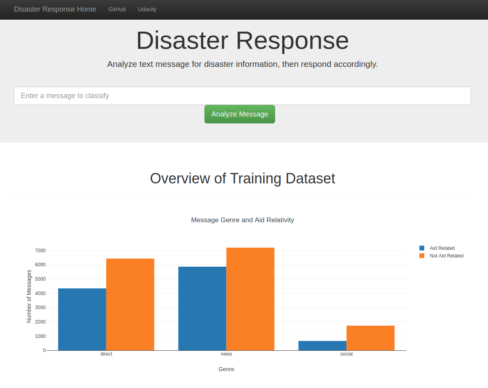

# Disaster Response


> a project from  [Data Scientist NanoDegree programme by Udacity](https://www.udacity.com/course/data-scientist-nanodegree--nd025)

This project aims to extract useful information about natual disasters from messages on social networks, news and et c.

The project consists of the following three parts:

- [ETL Pipeline](#ETL)
- [ML Pipeline](#ML)
- [Web Application](#WebApp)

**NOTE:** before running anything, please check the [dependencies](#Dependencies).

<a name="ETL"></a>
## ETL Pipeline

ETL is the abbreviation for Extract-Transform-Load. The pipeline extract data from files (can also add support databases and web APIs), and then performs basic transformation and cleaning on the data before loading the data to a database
structure.

##### File Structure:

- `data/messages.csv`: input messages to be cleaned.
- `data/categories.csv`: input categories of the messages above.
- `data/disaster_sn_msg.db`: cleaned data extracted from the above csv files
- `process_data.py`: ETL script, i.e. read the csv files, clean the data and then save as a db file.

##### To run the ETL pipeline

```shell script
python process_data.py -m data/messages.csv -c data/categories.csv -d data/disaster_sn_msg.db
```

**NOTE:** running the `process_data.py` with default database path will **FAIL** because the file is included in this repo.

Options:

- `-m`: the path to messages.csv.
- `-c`: the path to categories.csv.
- `-d`: the path to save the generate database file.

<a name="ML"></a>
## ML Pipeline

The ML pipeline takes the text data from the database generated by the ETL pipeline, extract TD-IDF and other features, and fit a multi-output model to classify if the message is disaster related and in what way.

##### File Structure:

- `ml_ppl.py`: script that defines functions of ML pipeline building, performance evaluation
- `train_classifier.py`: script to load the database, train a model of desired classifier and save it to a pkl file.
- `Ada_model.pkl`: a trained AdaBoost model.
- `XG_model.pkl`: a trained XGBoost model.

**NOTE:** `ML_pipeline_whole.ipynb` though not a part of the finalized pipeline, the notebook shows the entire process of the construction ML pipeline, including model prototyping steps such as `GridSearchCV` for both AdaBoost model and XGBoost model.


An example pipeline using AdaBoost as classifier is as follows.

```python
ada_ppl = Pipeline([
            ('features', FeatureUnion([
                    ('text_pipeline', Pipeline([
                            ('vect', CountVectorizer(
                                    tokenizer=tokenize,
                                    max_df=0.4
                            )),
                            ('tfidf', TfidfTransformer())
                    ])),
                    ('starting_verb', StartingVerbExtractor())
            ])),
            ('clf', MultiOutputClassifier(
                    AdaBoostClassifier(
                            n_estimators=51,
                            learning_rate=1.2
            )))
    ])
```

##### To run the ML pipeline

```shell script
python train_classifier.py -d data/disaster_sn_msg.db -m model.pkl  -t Ada
```

Options:

- `-d`: the path to save the generate database file.
- `-m`: the path to save the model.
- `-e`: add this option to enable printing performance metrics.
- `-g`: add this option to use `GridSearchCV` model instead of Pipeline object.
- `-t`: type of classifier, only `Ada` and `XG` available.

 <a name="WebApp"></a>
## Web Application

Web application constitute a web page containing an overview of given data, and also provide real time text analysis service.

##### File Structure:

- `app/run.py`: script that renders the app as well as plotly graphs.
- `app/templates/go.html`: extend template file.
- `app/templates/master.html`: template file from BootStrap, modified according to our needs.

Here is a screenshot of the webpage.



##### To run the Web App

```shell script
python app/run.py -d ./data/disaster_sn_msg.db -m ./Ada_model.pkl
```

Options:

- `-d`: the path to the database file.
- `-m`: the path to the model, both AdaBoost and XGBoost model can be found in the repo.
- `-p`: the port to access the webpage, default port is 3001

<a name="Dependencies"></a>
### Dependencies

Running this project reqires the following packages.
- flask==1.1.1
- joblib==0.14.1
- nltk==3.4.5
- numpy==1.18.1
- pandas==1.0.0
- plotly==4.5.0
- python==3.7.6
- re2==2019.08.01
- requests==2.22.0
- scikit-learn==0.22.1
- scipy==1.4.1
- sqlalchemy==1.3.15
- sqlite=3.31.1
- xgboost==1.0.2
- yaml==0.1.7

